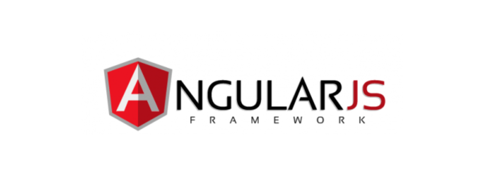

# Angularjs-Dashboard
Angularjs based application having Dashboard layout

LIVE URL : http://angularone.herokuapp.com/

> Logos of Heroku, Angular and Node are Respective Logo owner's property.

<!-- 

     
 -->

<!-- **Table of Contents** -->

<!-- [TOCM]

# Table of Contents
1. [Example](## A Little Briefing)
2. [Example2](### Presenting, Angular plus Node setup for Heroku)
3. [Third Example](#third-example)

[TOC] -->

### Angularjs Dahsbord, built for Heroku

## Ingredients

Setup Includes:

| FrontEnd   | Other Libraries  |
| ------------ |  ------------ |
|  AngularJS v1.6.6  | Bootstrap v3.3.7 , jQuery v3.2.1  |

## Getting Started
After downloading Repo, run `npm install` from root directory
To run project, type `node server.js` and you are good to go.

## Whats extra needed for Heroku setup
First of all, [Heroku Step-by-Step Documentation for project deployment ](https://devcenter.heroku.com/articles/getting-started-with-nodejs#set-up "Documentation for project deployment ") is quite simple and informative. It is enough to get you through, which asks a few things extra to do:

- A Proctfile,  (Save it with .js extension)
- A few commands to **SCALE THE APP** available [here](https://devcenter.heroku.com/articles/getting-started-with-nodejs#scale-the-app "here")

## Folder Structure

	|-Angularjs-Dashboard
       ├── app                       # Source files
            ├── dash/                # Dashboard files
            ├── scripts/             # Script.js having routes/Controllers 
            ├── index.html           # Entry point where other views are loaded
            ├── views/main.html      # Main page, other than Dashboard
       ├── node_modules      #Which will be shown after running `npm install`
       ├── Server.js                # Tools and utilities
       ├── package.json
       └── README.me
     
	 

## Next on List

- Adding examples of Unit test, Form submission and API interaction in angularjs

## End
Feel free to open bugs. Its the only way to seek help from me hi@sudheerkaushik.com
